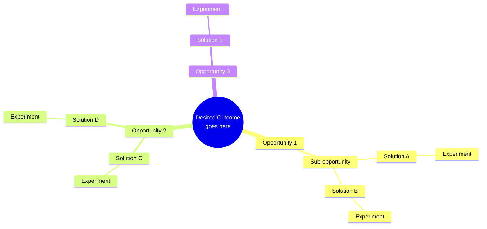

Run a Product Trio discovery session to produce an Opportunity Solution Tree (OST).

$ARGUMENTS is a path to a PRD or requirements document. If omitted, read `docs/PRD.md`.

---

## Step 1 — Load requirements

Read the document at the path given in $ARGUMENTS (or `docs/PRD.md` if none provided).

Extract and state aloud:
- The problem space in one sentence
- The primary user(s)
- The implied business goal

---

## Step 2 — Three-perspective discovery (run all three in parallel)

Pass the full document text to each agent simultaneously:

- **@agent-product-manager** — What is the single desired outcome (the metric that defines success)? What opportunity areas have customer evidence behind them? What assumptions are we making that need validation?

- **@agent-product-designer** — Map user journeys and surface specific pain points, needs, and desires. For the top 3 opportunities, propose 2-3 solution directions as hypotheses. Flag design risks.

- **@agent-discovery-tech-lead** — Assess technical feasibility per opportunity area. What does the platform already enable? What hard constraints must shape solution design? For the top solution directions, what is the highest-risk technical assumption to test first?

---

## Step 3 — Synthesize into an Opportunity Solution Tree

Combine the three perspectives into a single OST following Teresa Torres's Continuous Discovery Habits framework.

**OST structure rules:**
- **Root** = one desired outcome — a metric or behavior change, never a feature or project title
- **Level 1 — Opportunities** = customer needs, pain points, desires — in the customer's words, not the team's; sub-opportunities may nest under parent opportunities
- **Level 2 — Solutions** = concrete ideas (features, flows, partnerships, content) that address a specific opportunity; one solution may address only one opportunity
- **Level 3 — Experiments** = the fastest, cheapest test to validate the riskiest assumption for that solution; one per solution

Target: 3–5 top-level opportunities, 2–3 solutions per top opportunity, 1 experiment per solution.

---

## Step 4 — Output

### 4a — Mermaid mindmap

Produce the OST as a Mermaid mindmap. Keep node labels short (≤6 words). Use ` ` for line breaks in the root label only.

### 4b — Narrative brief (max 400 words)

- **Desired outcome**: What metric, why chosen, how we'll know we're moving it
- **Top 3 opportunities**: Customer statement for each ("When I… I struggle to… because…"), which segment, what evidence supports it
- **Recommended solution bets**: 1–2 solutions with the strongest signal from all three perspectives
- **Highest-priority experiment**: The single fastest thing to run — what we're testing, how, success criteria
- **Open questions**: What the trio couldn't resolve — needs customer research, stakeholder input, or technical spike

---

## Step 5 — Epic handoff offer

Ask the user:
"Shall I create Jira epics for the top opportunities so `/refinement-squad` can refine them into stories? (yes/no)"

If yes: use the Atlassian MCP (`mcp__claude_ai_Atlassian_Rovo__createJiraIssue`) to create one epic per top-level opportunity. For each epic:
- **Summary**: the opportunity statement (customer language)
- **Description**: solution directions from the OST + the experiment to run first + link to the source PRD
- **Issue type**: Epic